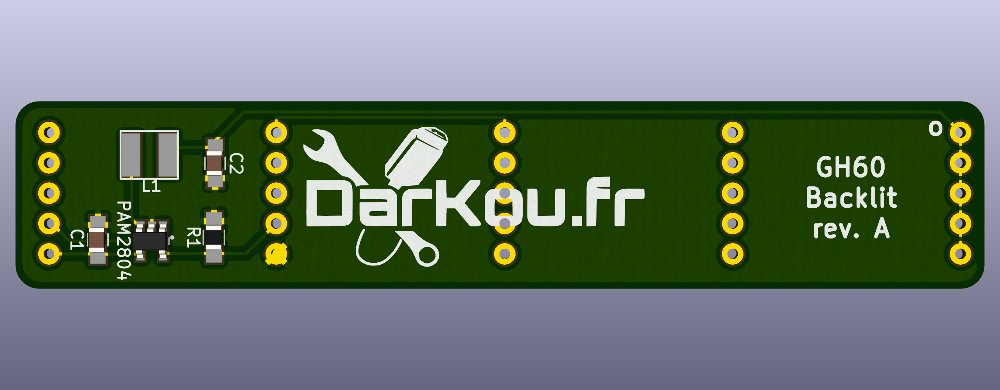

# gh60_backlit
GH60 backlit module

:warning: Still in development and not tested :warning:

## Goal

This is a simple module to add backlit on the origianl [GH60 PCB rev. C](http://blog.komar.be/projects/gh60-programmable-keyboard/).

It use GPIO2 (FN led) to enable backlit.

## PCB render

